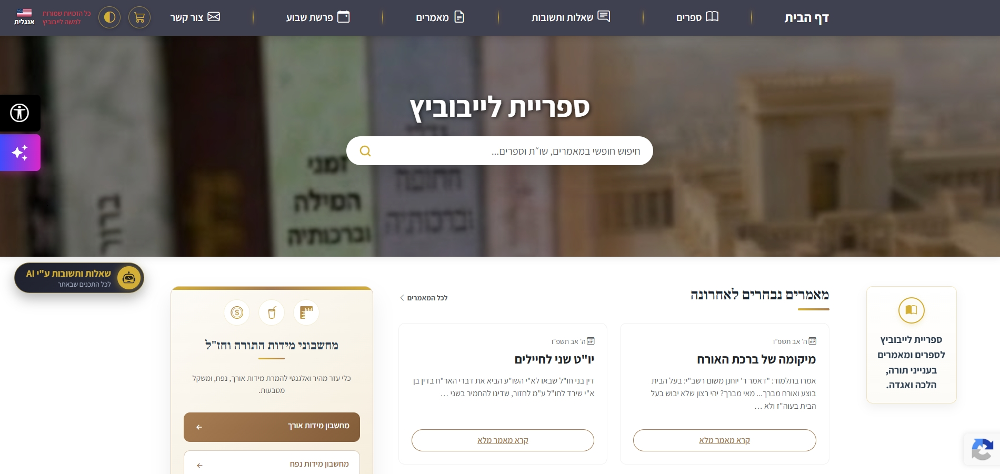

# LebLibrary
### ספריית לייבוביץ

A personal digital library and article management platform, built to share knowledge, articles, and resources in a clean, accessible format.

**Live Site:** [https://leblibrary.co.il](https://leblibrary.co.il)

---

## 📸 Preview
> *Screenshot of the live platform interface.*

---

## 📖 Overview
This project is a custom Django-based web application serving as a centralized repository for articles, tutorials, and books. It features a responsive reading interface, a dedicated book catalog, and integrated SEO tracking. The platform is designed with simplicity and a distraction-free user experience in mind, empowered by custom AI agents.

---

## ✨ Key Features
* **Article & Content Management:** Browse and read structured articles with a built-in reading progress indicator.
* **Responsive UI:** Mobile-friendly layouts, clean navigation, and smooth modal interactions.
* **SEO Optimized:** Verified and integrated with Google Search Console for organic search visibility.
* **Static Asset Management:** Structured handling of static files, CSS, and custom branding (Favicon).

---

## 🤖 AI-Powered Capabilities & Agents
The platform features integrated custom AI agents designed to elevate the user experience:
1. **Content & Knowledge Expert Agent:** Searches deeply through the platform's article repository to deliver professional, comprehensive answers accompanied by precise references and citations.
2. **Site Navigation & Orientation Agent:** Assists users in exploring the platform, providing dynamic routing, guidance, and helpful references to relevant pages and resources.

---

## 🛠️ Tech Stack
* **Backend:** Python, Django
* **Frontend:** HTML5, CSS3, JavaScript
* **Server & Deployment:** Ubuntu Linux, Gunicorn, Nginx
* **Version Control:** Git & GitHub

---

## 🚀 Getting Started (Local Development)
To run this project locally for development or testing:

1. **Clone the repository:**
    git clone https://github.com/mole28/leblibrary.git
    cd leblibrary

2. **Install dependencies:**
    pip install -r requirements.txt

3. **Run database migrations:**
    python manage.py migrate

4. **Start the development server:**
    python manage.py runserver

---

## 📋 Deployment & Maintenance Cheat Sheet
This section documents the standard workflow for updating the live production server.

### 1. Pushing Local Changes (Development Environment)
After modifying templates (e.g., `base.html`), adding static files, or updating Python logic:

    # Stage all changes
    git add .

    # Commit with a descriptive message
    git commit -m "Update description here"

    # Push to the main branch
    git push